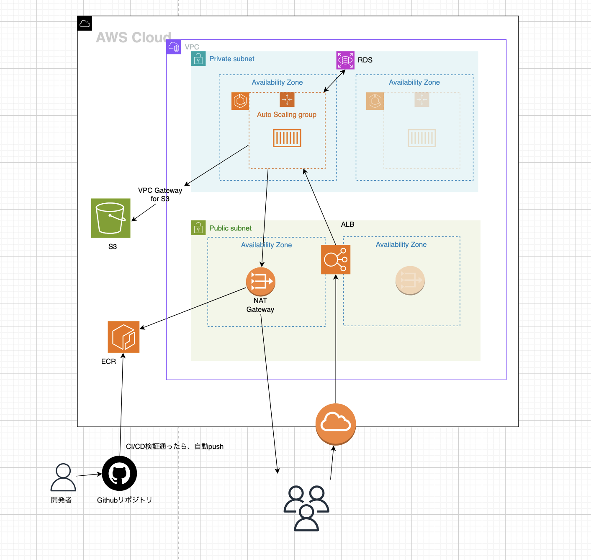

# Rails on AWS - Terraform Infrastructure

RailsアプリケーションをAWS上で動かすためのインフラ構成をTerraformで管理します。

## 構成図



## 通信経路

| 経路 | 説明 |
|-----|------|
| Users → IGW → ALB → ECS | ユーザーからのリクエスト |
| ECS → RDS | データベース接続 |
| ECS → VPC GW for S3 → S3/ECR | ファイルアクセス / イメージ取得 |
| 開発者 → GitHub → ECR | CI/CDでイメージをpush |

## ファイル構成

```
terraform/
├── main.tf              # プロバイダー設定
├── variables.tf         # 変数定義
├── vpc.tf               # VPC, Subnet, IGW, NAT GW
├── ecr.tf               # ECR リポジトリ
├── ecs.tf               # ALB, ECS, IAM, Security Group
├── rds.tf               # RDS PostgreSQL
├── s3.tf                # S3 バケット
├── outputs.tf           # 出力値
└── terraform.tfvars.example  # 変数サンプル
```

## 前提条件

- Terraform >= 1.0.0
- AWS CLI 設定済み
- 適切なIAM権限

## 使い方

### 1. 変数ファイルの作成

```bash
cd terraform
cp terraform.tfvars.example terraform.tfvars
```

### 2. 変数の編集

```hcl
# terraform.tfvars
project_name   = "my-rails-app"
environment    = "dev"
aws_region     = "ap-northeast-1"
db_password    = "your-secure-password"
s3_bucket_name = "my-rails-app-storage-dev-123456"
```

### 3. 初期化

```bash
terraform init
```

### 4. プラン確認

```bash
terraform plan
```

### 5. 適用

```bash
terraform apply
```

### 6. 削除（必要な場合）

```bash
terraform destroy
```

## コンポーネント詳細

### VPC

| 項目 | 値 |
|-----|-----|
| CIDR | 10.0.0.0/16 |
| Public Subnet | 10.0.0.0/24, 10.0.1.0/24 |
| Private Subnet | 10.0.10.0/24, 10.0.11.0/24 |

### ECS (Fargate)

| 項目 | 値 |
|-----|-----|
| CPU | 256 (0.25 vCPU) |
| Memory | 512 MB |
| Port | 3000 |
| Health Check | /health |

### RDS (PostgreSQL)

| 項目 | 値 |
|-----|-----|
| Engine | PostgreSQL 15.4 |
| Instance | db.t3.micro |
| Storage | 20GB (gp3) |
| Encryption | 有効 |

### S3

| 項目 | 値 |
|-----|-----|
| Versioning | 有効 |
| Encryption | AES256 |
| Public Access | ブロック |

## セキュリティグループ

```
┌─────────────┐      ┌─────────────┐      ┌─────────────┐
│   ALB SG    │      │   ECS SG    │      │   RDS SG    │
├─────────────┤      ├─────────────┤      ├─────────────┤
│ In: 80,443  │ ──►  │ In: 3000    │ ──►  │ In: 5432    │
│ from: Any   │      │ from: ALB   │      │ from: ECS   │
└─────────────┘      └─────────────┘      └─────────────┘
```

## Rails側の設定

### database.yml

```yaml
production:
  adapter: postgresql
  host: <%= ENV['DATABASE_HOST'] %>
  database: <%= ENV['DATABASE_NAME'] %>
  username: <%= ENV['DATABASE_USERNAME'] %>
  password: <%= ENV['DATABASE_PASSWORD'] %>
```

### storage.yml

```yaml
amazon:
  service: S3
  region: <%= ENV['AWS_REGION'] %>
  bucket: <%= ENV['S3_BUCKET'] %>
```

### Gemfile

```ruby
gem 'aws-sdk-s3', require: false
```

## コスト概算（東京リージョン）

| リソース | 月額概算 |
|---------|---------|
| NAT Gateway | ~$45 |
| ALB | ~$20 |
| ECS Fargate (2タスク) | ~$20 |
| RDS (db.t3.micro) | ~$15 |
| S3 | 使用量による |
| **合計** | **~$100/月** |

## 本番環境への移行

本番環境では以下を検討する：

- [ ] NAT Gatewayを各AZに配置（高可用性）
- [ ] RDSのMulti-AZ有効化
- [ ] ECS Auto Scaling設定
- [ ] HTTPS (ACM証明書 + Route53)
- [ ] CloudFront導入
- [ ] WAF設定
- [ ] S3バックエンドでtfstate管理
