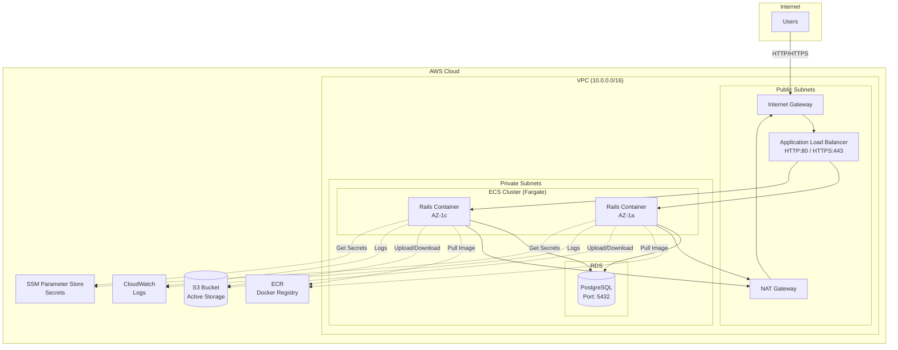
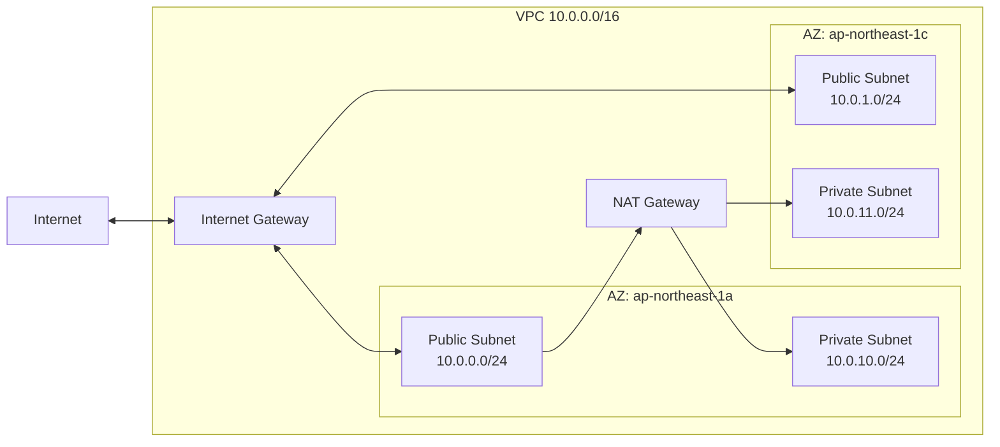
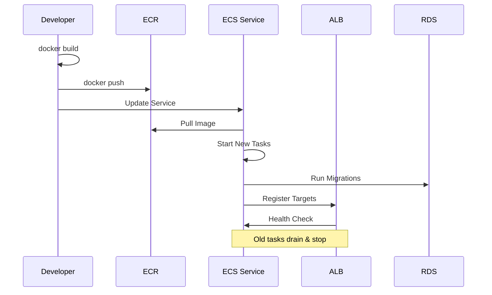
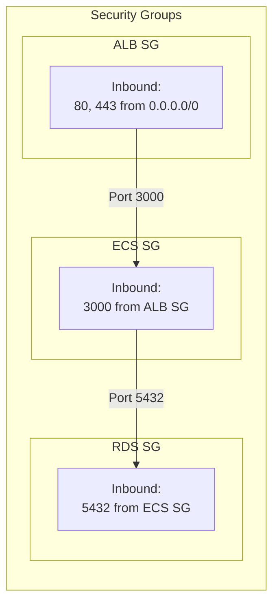

# AWS Infrastructure Architecture

## 全体構成図

## ネットワーク構成

## デプロイフロー

## セキュリティグループ

## コンポーネント一覧

| Component | Service | Description |
|-----------|---------|-------------|
| Load Balancer | ALB | HTTP/HTTPS トラフィック分散 |
| Container | ECS Fargate | Rails アプリケーション実行 |
| Database | RDS PostgreSQL | データ永続化 |
| Storage | S3 | ファイルストレージ (Active Storage) |
| Registry | ECR | Docker イメージ管理 |
| Secrets | SSM Parameter Store | DB パスワード等の機密情報 |
| Logging | CloudWatch Logs | アプリケーションログ |
